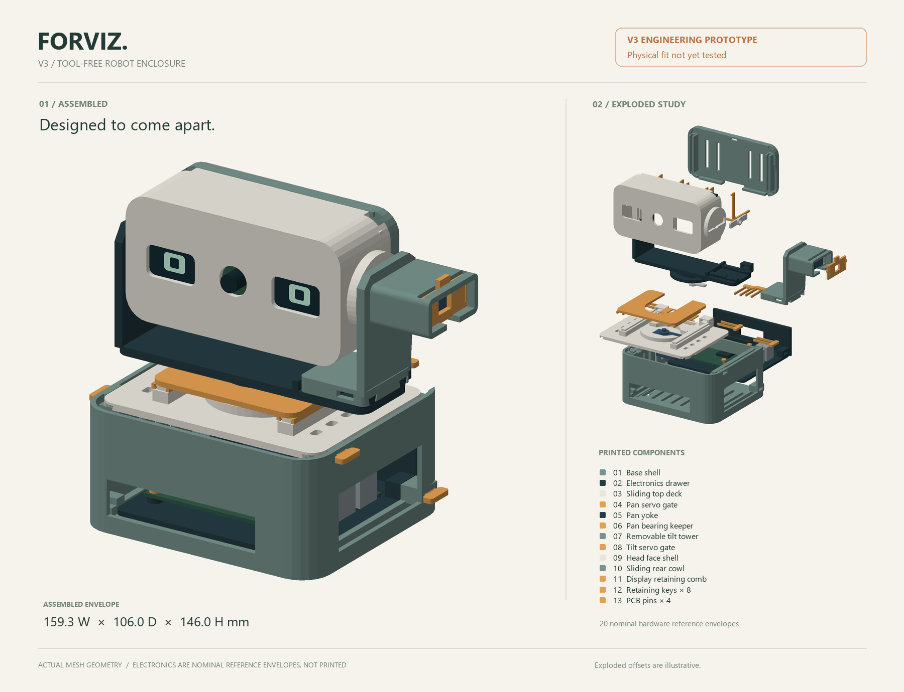

# FORVIZ — face-tracking robot

FORVIZ is a stationary Raspberry Pi robot with a pan/tilt head, a camera, and one or two animated OLED displays. YuNet detects faces, the controller follows the largest face, and the eyes become happy after it stays centered for one second.

The V3 enclosure is a modular design intended for **PLA printing with a 0.4 mm nozzle**, using removable printed retainers and mechanically captive stock servo horns. No glue or added assembly screws are intended. **V3 is an engineering prototype; physical fit and loaded operation have not yet been tested.** Print the fit coupons and follow the mechanical guide before printing and assembling everything.

- [V3 mechanical and printing guide](docs/MECHANICAL_V3.md)
- [V3 printable STL files](3d_models/v3/stl)
- [Interactive 3D preview](docs/robot_preview.html) — download/open locally; works offline
- [Runtime, calibration, and troubleshooting](docs/RUNTIME.md)



## Hardware

| Component | Quantity | Purpose |
| --- | --- | --- |
| Raspberry Pi 4 Model B | 1 | Camera capture and face detection |
| Raspberry Pi Camera Rev 1.3 | 1 | CSI camera input |
| SG90 positional micro servo, with stock horn | 2 | Pan and tilt |
| 0.96-inch 128×64 SSD1306 I2C OLED | 2 for V3 | One eye per display; software also supports one display |
| Regulated external 5 V servo supply | 1 | Servo power, with ground shared with the Pi |
| Raspberry Pi power supply, wiring, and CSI ribbon | As needed | Controller power and interconnections |

Check your actual PCB, servo, and horn dimensions against the [mechanical guide](docs/MECHANICAL_V3.md). Modules sold under the same name can have different outlines. Use the specified stock horns in the printed captive mechanism; do not add horn-retaining screws or modify the servo internals.

## Wiring

Disconnect power before changing wiring. Power the servos from the external regulated 5 V supply and the Pi from its own suitable supply. Join the external supply ground to Pi ground; do not join the two supplies' positive outputs. Wire colors vary, so check the component labels.

| Connection | Destination |
| --- | --- |
| Pan servo signal | BCM GPIO 12, physical pin 32 |
| Tilt servo signal | BCM GPIO 19, physical pin 35 |
| Both servo positive leads | External regulated 5 V |
| Both servo grounds | External supply ground and Pi GND, e.g. physical pin 34 |
| Camera ribbon | Pi CSI camera connector |

Use separate buses for two OLEDs with the same `0x3C` address:

| OLED connection | Left display / bus 1 | Right display / bus 3 |
| --- | --- | --- |
| VCC | 3.3 V, physical pin 1 | 3.3 V, physical pin 17 |
| GND | Physical pin 9 | Physical pin 25 |
| SDA | BCM GPIO 2, physical pin 3 | BCM GPIO 23, physical pin 16 |
| SCL | BCM GPIO 3, physical pin 5 | BCM GPIO 24, physical pin 18 |

The optional bus-3 setup below enables the second display. A display already configured for `0x3D` can instead share bus 1 with a `0x3C` display. The software probes supported addresses automatically.

## Set up the Raspberry Pi

Copy the complete project to the Pi and run these commands from its directory:

```bash
bash setup_pi.sh
```

The script installs system packages, enables I2C, attempts to start `pigpiod`, and downloads the YuNet model if it is missing. Check its output: some optional installation and service failures are reported without stopping the script. Keep `pi_tracker.py`, `servos.py`, and `oled_face.py` together. The main program imports the shared controllers.

For the second OLED on GPIO 23/24:

```bash
bash enable_dual_oled.sh
python3 test_oled.py --scan
```

Reboot if bus 3 is not available after enabling it. See [runtime setup troubleshooting](docs/RUNTIME.md#setup-and-dependencies) for dependency versions and `pigpiod` checks.

## Calibrate before tracking

1. **Simulate the servo sequence.** This runs without GPIO output or a camera:

   ```bash
   python3 test_servos.py --dry-run
   ```

2. **Center the unloaded servos before fitting the horns.** Support any attached head; this command holds both outputs at 90° until Ctrl+C:

   ```bash
   python3 test_servos.py --center-only
   ```

   Stop the command and disconnect servo power before fitting the stock horns and printed retainers. Preserve the neutral shaft orientation and follow the [V3 assembly guide](docs/MECHANICAL_V3.md). Stopping releases holding torque.

3. **Run the camera and servos manually with a narrow first sweep.** Keep the robot attended and check the ribbon, wires, joint clearance, and direction of movement:

   ```bash
   python3 pi_tracker.py --no-oled --headless \
     --pan-min 80 --pan-max 100 --tilt-min 80 --tilt-max 100 \
     --servo-speed 12 --scan-speed 6
   ```

   This command moves the real servos. Stop with Ctrl+C and support the head before power is removed. Increase the permitted range gradually only after verifying clearance. Software angle limits do not establish mechanical clearance or prevent a wrongly assembled joint from binding.

After the physical checks and OLED test, start normal operation:

```bash
python3 test_oled.py --dual
python3 pi_tracker.py
```

Default limits are **pan 40–140°** and **tilt 65–115°**, with both centers at 90°. Motion is limited to 36°/s; pan scanning uses 18°/s. These are conservative software starting values, not measured guarantees for your assembled print.

## Behavior

| State | Motion | Eyes |
| --- | --- | --- |
| `SCANNING` | Pan sweeps between configured limits; tilt eases toward its calibrated center | Neutral with scanning gaze |
| `TRACKING` | Pan and tilt move toward the largest detected face | Neutral, gaze follows the face |
| `LOCKED` | No movement inside the shared centering deadband | Happy after one continuous second centered |
| `HOLDING` | Holds position during a brief missed detection, for up to 1.5 seconds | Neutral with previous gaze |

The servos retain PWM while stationary by default so the head keeps holding torque. Optional `--idle-detach-after` releases that torque; it does not disconnect electrical power or guarantee a cool servo. Shutdown releases PWM without automatically moving the head back to center.

This is face detection and tracking. The heart expression in the OLED demonstration is a manually selected animation, with no identity recognition attached to it.

## Useful commands

| Task | Command |
| --- | --- |
| Camera and simulated servo telemetry, no OLED output | `python3 pi_tracker.py --no-servo --no-oled` |
| One detected OLED displaying both eyes | `python3 pi_tracker.py --single-oled` |
| Force a desktop camera preview | `python3 pi_tracker.py --preview` |
| Headless operation | `python3 pi_tracker.py --headless` |
| All runtime options | `python3 pi_tracker.py --help` |
| Hardware-free regression tests | `python3 -m unittest discover -s tests -v` |
| Rebuild the offline 3D viewer and PNG after a geometry export | `python3 tools/build_robot_preview.py` |

`--no-servo` disables physical servo output but continues calculating angles for telemetry. It still opens the camera. `--no-oled` only disables display output. The [runtime guide](docs/RUNTIME.md) describes all calibration flags, the PC vision demo, and validation limits.

## Source layout

| Path | Role |
| --- | --- |
| `pi_tracker.py` | Camera, YuNet detector, tracking state, CLI, and runtime cleanup |
| `servos.py` | Shared pan/tilt controller with elapsed-time motion |
| `oled_face.py` | Shared eye renderer and asynchronous OLED driver |
| `test_servos.py`, `test_oled.py` | Manual hardware demonstrations |
| `test_vision.py`, `run_pc_test.bat` | PC webcam vision demonstration |
| `tests/test_runtime.py` | Automated regressions with simulated hardware |
| `3d_models/v3/` | V3 source, exported assembly, and printable parts |
| `docs/` | Mechanical guide, runtime guide, and generated preview |
